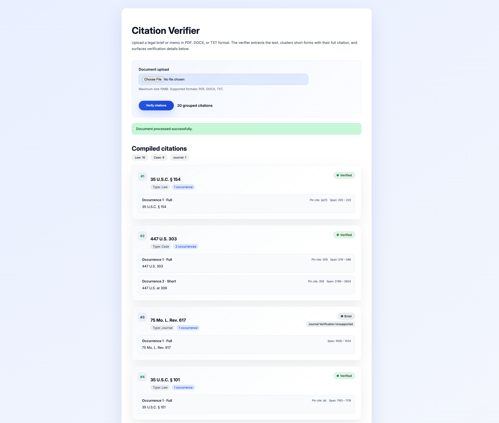
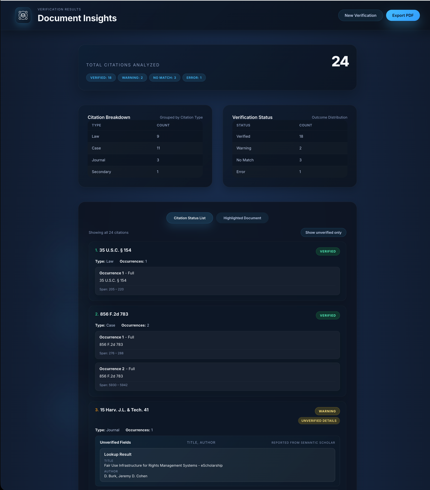
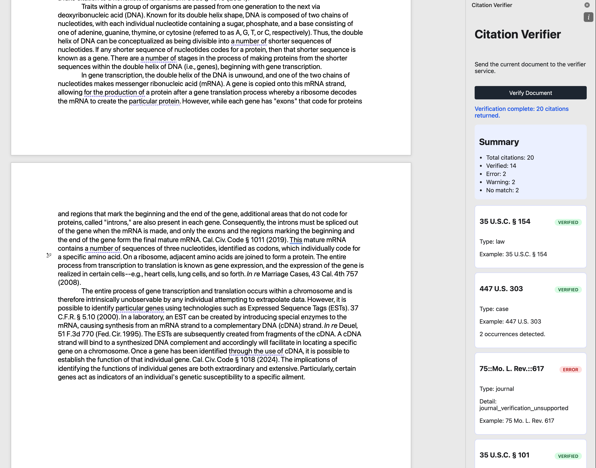

# Citation Verifier

Full-stack toolchain that verifies legal citations in legal briefs, memos, journal articles, and other legal and academic documents against primary sources. Available as a web service with a Next.js frontend that accepts DOCX, PDF, and plain text documents. The backend is a containerized python service that extracts citations from a document (both inline citations and footnotes are compatible), normalizes them, and then verifies each citation. The annotated results are displayed with contextual highlights. The service is also available as a Microsoft Word Add-In. 

See [/addons/word-taskpane](/addons/word-taskpane/README.md) for further details about Word integration. 

(Note: Citations are assumed to be in Bluebook standard format.)

## Screenshots

### Next.js UI - Citation Verification List


### Next.js UI - Uploaded Document with Verification Indicators


### Word Add-In UI



## Overview
- **Document ingestion**: Accepts PDF (text or scanned), DOCX, and plain text files up to 10 MB. Compatible with both inline citations and footnote citations. 
- **Text normalization**: Uses PyMuPDF, python-docx, and Tesseract OCR when needed to produce a clean text stream with inline footnote content.
- **Citation resolution**: eyecite identifies full, short, id., supra, and reference citations, clusters short forms with their full cite, and records pin cites and spans.
- **Verification**:
  - **Case law**: CourtListener citation lookup with fuzzy matching (RapidFuzz) to flag name/year discrepancies.
  - **Federal law**: GovInfo link service with reporter-aware URL building for U.S.C., C.F.R., Stat., Pub. L., Fed. Reg., and related materials.
  - **State law**: OpenAI `gpt-5` Responses API plus constrained web search (Justia, Cornell LII, FindLaw) to score validity and return a matching or nearly matching citation, as well as a confidence score corresponding to verification status. 
  - **Journals**: OpenAlex API query with fallback to Semantic Scholar API query. Queries an API on title and author, fallback to query on volume, journal, page, and year.
  - **Secondary Sources**: Library of Congress API query. Limited support.   
- **Results delivery**: FastAPI serializes a single payload containing citation metadata, status/substatus, occurrences, and extracted text for the UI.

Pipeline: `document upload → /api/verify (FastAPI) → extract_text → compile_citations → verifiers → JSON response → Next.js renderer`.

### Known Issues & Limitations
- **Bluebook format**: Citations must follow standard Bluebook rules. No support is planned for other formats. 
- **URLs and other citations**: Supported citations types: (1) federal cases; (2) federal law; (3) state cases; (4) state laws; (5) journals; (6) secondary legal sources (limited). URLs and citation types other than those listed above are not supported. Support for other citations is in development. 
  - Work item. No estimated date of delivery. 
- **_infra_ short citations**: Short citations using _infra_ are not supported. To request this feature, contact [support@phaethon.llc](mailto:support@phaethon.llc).  

## System Architecture
### Backend (Python)
- **FastAPI** (`main.py`): Exposes `POST /api/verify`, enforces file-type checks, orchestrates extraction and verification, and returns a typed response model.
- **Document processing** (`svc/doc_processor.py`):
  - PDF parsing via PyMuPDF with heuristics to merge wrapped lines and pull footnotes into context.
  - DOCX traversal that walks paragraphs, nested tables, and footnote XML, inlining references next to their markers.
  - OCR fallback for image-only PDFs using Pillow + Tesseract.
  - Normalization routines that standardize whitespace, smart quotes, and superscripts.
- **Citation compiler** (`svc/citations_compiler.py`): Cleans text, resolves eyecite clusters to stable `ResourceKey`s, records occurrences, and calls the appropriate verifier based on citation type and jurisdiction classification.
- **Verification modules** (`verifiers/`):
  - `case_verifier.py`: CourtListener integration with credential support, year extraction, and fuzzy name comparisons.
  - `federal_law_verifier.py`: Jurisdiction heuristics, GovInfo request builder, and reporter-specific parsing (e.g., CFR parts vs. sections).
  - `secondary_sources_verifier.py`: Secondary legal sources such as legal encyclopedias (C.J.S., Am. Jur.), restatements, and treatises by querying
the Library of Congress Search API; fuzzy matching on results
  - `state_law_verifier.py`: Constructs Bluebook-style prompts and interprets structured JSON replies with confidence scoring.
- **Utilities** (`utils/`): Shared logging (env-aware file/console handlers), string cleaning, and span recovery for eyecite tokens.

### Frontend (Next.js 15 / React 18)
- Single-page workflow in `app/page.tsx` for file upload, async status messaging, and rich results display.
- Highlights occurrences inside the extracted text, color-coded by verification status with numbered badges.
- Summaries group citations by type, while each citation card shows type, occurrences, substatus, and verifier-supplied diagnostics.
- `BACKEND_URL` configures the backend target; defaults to `http://localhost:8000` for local development.

## Project Layout
```
├── main.py                           # FastAPI entrypoint
├── addons/word-taskpane              # Word Add-In service
│   └── ...                           # See Word Add-In README.md
├── app/                              # Next.js application (App Router)
│   ├── layout.tsx                    # Global metadata and styling
│   └── page.tsx                      # Upload form + results dashboard
├── svc/
│   ├── doc_processor.py              # Text extraction and normalization
│   ├── citations_compiler.py         # Eyecite integration and verifier dispatch
│   ├── secondary_citation_handler.py # Extracts secondary legal sources (supplement eyecite)
│   └── string_citation_handler.py    # Formats string citations
├── verifiers/                        # Citation verification services
│   ├── case_verifier.py
│   ├── federal_law_verifier.py
│   ├── journal_verifier.py
│   ├── secondary_sources_verifier.py
│   └── state_law_verifier.py
├── utils/                            # Logging, cleaning, span helpers
│   ├── cleaner.py
│   ├── logger.py
│   ├── resource_resolver.py
│   └── span_finder.py
├── resources/                        # Sample documents and reference material
├── Dockerfile                        # Container build
├── requirements.txt                  # Python dependency pins
├── package.json                      # Frontend dependencies
└── pyproject.toml                    # Backend build metadata
```

## Dependencies
### Python runtime
Major libraries are pinned in `requirements.txt`:
- `fastapi`, `uvicorn` – API framework and ASGI server
- `eyecite` – legal citation parsing and clustering
- `pymupdf`, `pytesseract`, `python-docx`, `Pillow` – document ingestion
- `httpx`, `rapidfuzz`, `openai` – verification clients and fuzzy matching
- `python-dotenv`, `werkzeug`, `regex`, `psycopg` (binary) – supporting utilities

### Node.js runtime
`next`, `react`, `react-dom`, `mammoth`, `pdf-parse`, and type definitions as listed in `package.json`.

### External services
- CourtListener citation lookup API (optional token support)
- GovInfo link service (API key recommended for higher rate limits)
- OpenAI Responses API (`gpt-5`) with built-in web-search tool access
- OpenAlex API and Semantic Scholar API (API key recommended) 
- Local Tesseract installation for OCR (`pytesseract` shell dependency)

## Setup
1. **Prerequisites**
   - Python 3.12 or 3.13
   - Node.js 18+ with npm
   - Tesseract OCR (`brew install tesseract` on macOS, `sudo apt-get install tesseract-ocr` on Debian/Ubuntu)
2. **Install backend packages**
   ```bash
   pip install -r requirements.txt
   ```
3. **Install frontend packages**
   ```bash
   npm install
   ```

## Configuration
Create `.env` in the project root to supply credentials and logging preferences:
```
COURTLISTENER_API_TOKEN=...   # State and federal case verifications
GOVINFO_API_KEY=...           # Federal law verifications
OPENAI_API_KEY=...            # State law verifications
LEGISCAN_API_KEY=...          # Active legislative data (e.g., active bills) verifications (not yet implemented)
SEMANTIC_SCHOLAR_API_KEY=...  # Journal verifications
LOG_TO_FILE=true              # optional: write logs to disk
LOG_FILE_PATH=./citeverify.log
BACKEND_URL=http://localhost:8000 or https://citation-verifier.onrender.com  
```
Environment variables fall back to sane defaults when omitted; state-law verification returns errors if no OpenAI key is present.

## Running Locally
```bash
# Backend (FastAPI)
uvicorn main:app --host 127.0.0.1 --port 8000 --reload
      
uvicorn main:app --host 127.0.0.1 --port 8000 --workers 2

# Frontend (Next.js) - run from repo root
npm run dev
```
- Visit `http://localhost:3000` to access the UI.
- Point the frontend at a different backend by setting `BACKEND_URL` before `npm run dev`.

## API
`POST /api/verify`
- **Payload**: multipart form with a single `document` field containing a PDF, DOCX, or TXT file.
- **Response** (`application/json`):
  ```json
  {
    "citations": [
      {
        "resource_key": "case::...",
        "type": "case|law|journal",
        "status": "verified|warning|no_match|error",
        "substatus": "...",
        "normalized_citation": "...",
        "resource": { "kind": "case", "id_tuple": ["..."] },
        "occurrences": [
          {
            "citation_category": "full|short|id|supra|reference",
            "matched_text": "...",
            "span": [start, end],
            "pin_cite": "..."
          }
        ],
        "verification_details": { /* verifier-specific metadata */ }
      }
    ],
    "extracted_text": "full normalized document text"
  }
  ```
- Errors use standard FastAPI problem responses (`detail` message with 4xx or 5xx).

## Usage Tips
- Uploads larger than ~10 MB or outside the accepted extensions are rejected before processing.
- The frontend highlights every matched occurrence in context; hover or scan the numbered badges to correlate cards with text spans.
- `substatus` explains why a citation is flagged with a warning or marked as false (e.g., `case name mismatch`, `closest_match: …`).

## Logging
`utils/logger.py` honors `LOG_TO_FILE`/`LOG_FILE_PATH` or defaults to console output. Log formatting matches `[timestamp] - logger level message` for easier aggregation.

## License

This repository is publicly viewable for portfolio purposes only. The code is proprietary.
Copyright © 2025 Phaethon Order LLC. All rights reserved.
Contact [support@phaethon.llc](mailto:support@phaethon.llc) for licensing or reuse requests.

See [LICENSE](LICENSE)

Note: `package.json` may list a different license string; the authoritative license for this repository is proprietary.

## Contact
Questions or support: [support@phaethon.llc](mailto:support@phaethon.llc).
