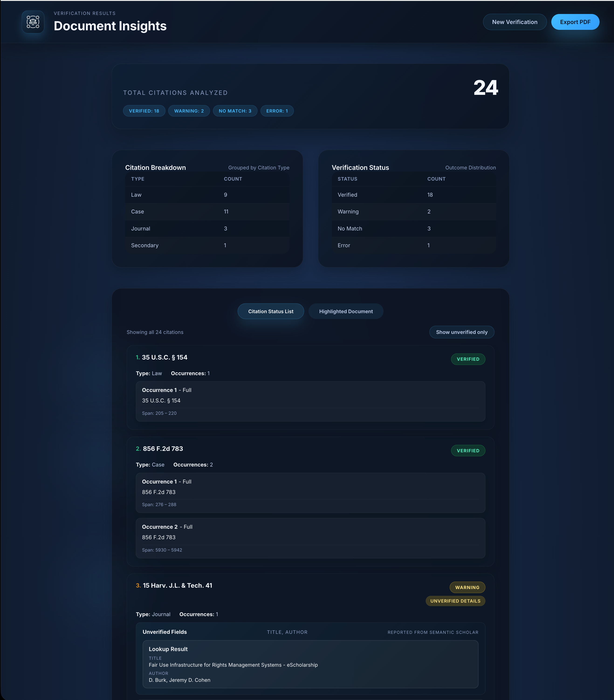
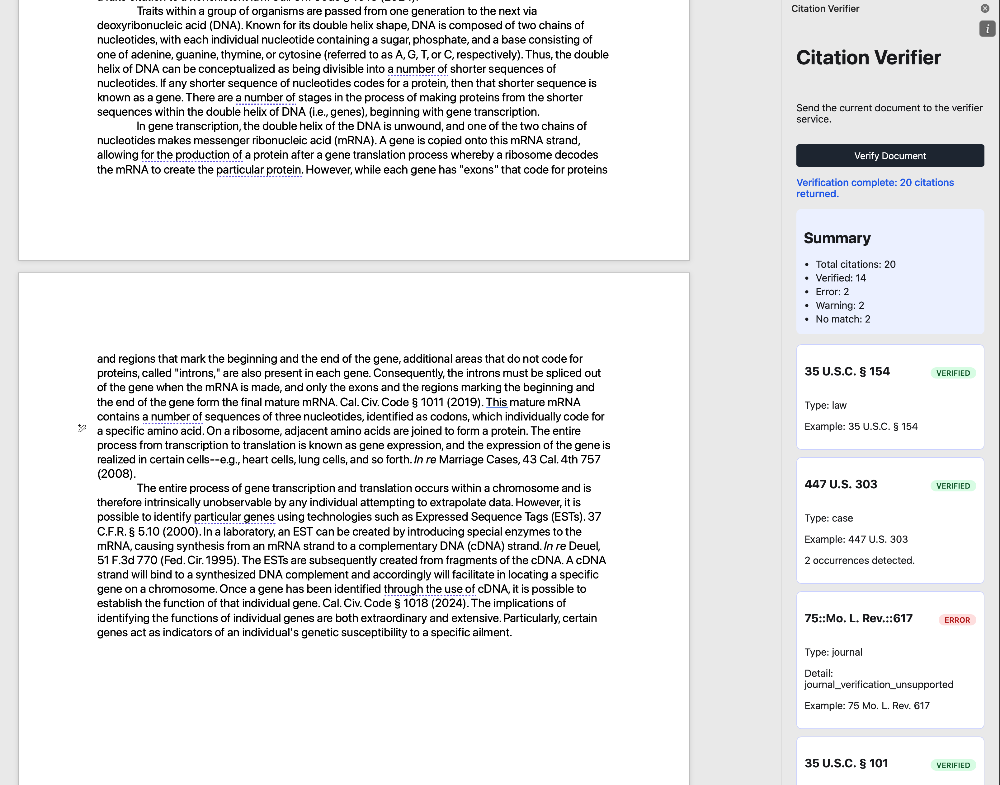
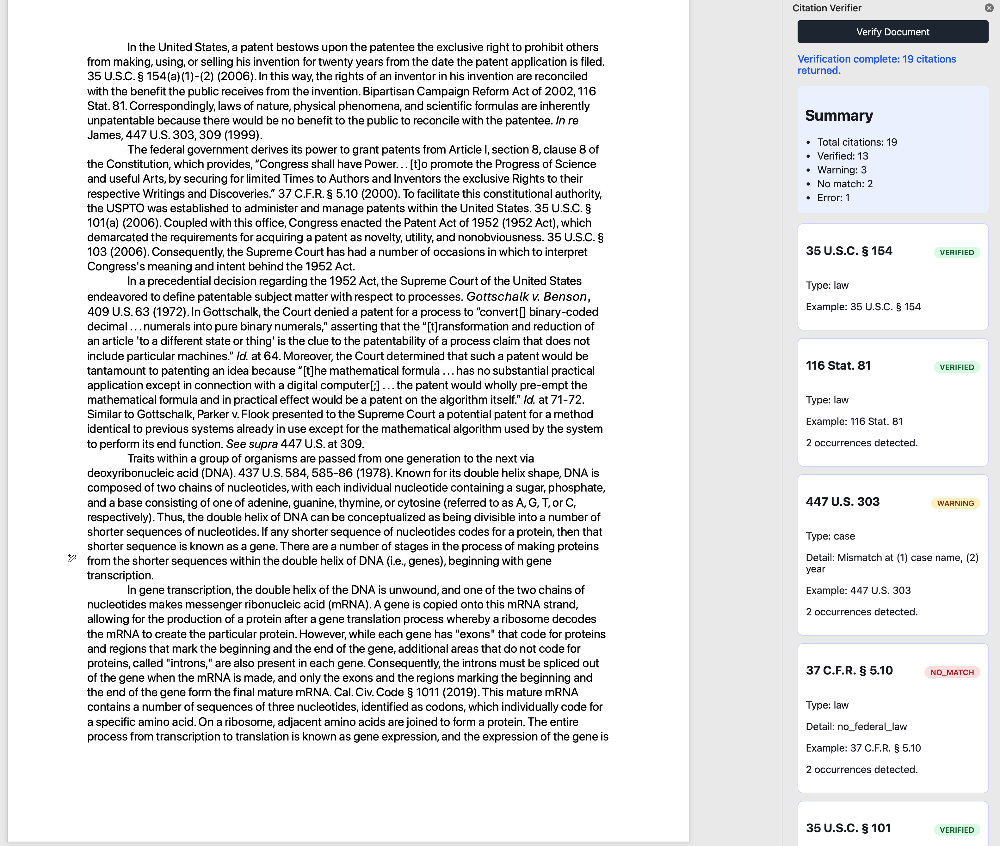

# JurisCheck - Citation Verification

Full-stack toolchain that verifies legal citations in legal briefs, memos, journal articles, and other legal and academic documents against primary sources. Available as a web service with a Next.js frontend that accepts DOCX, PDF, and plain text documents. The backend is a containerized Python service that extracts citations from a document (both inline citations and footnotes are compatible), normalizes them, and then verifies each citation. The annotated results are displayed with contextual highlights. The service is also available as a Microsoft Word Add-In. 

The deployed site now includes a public Terms of Use page (`/terms-of-use`) so firms can reference core usage, payment, and data-handling policies directly from the UI.

See [/addons/word-taskpane](/addons/word-taskpane/README.md) for further details about Word integration. 

(Note: Citations are assumed to be in Bluebook standard format.)

## Live Deployment
- App: https://www.jurischeck.com
- Demo login: `phaethon@phaethon.llc` / `pollc123#` (Auth0 username/password grant)

## Screenshots

### Next.js UI - Citation Verification List


### Next.js UI - Uploaded Document with Verification Indicators


### Word Add-In UI



## Overview
- **Document ingestion**: Accepts PDF (text or scanned), DOCX, and plain text files. Compatible with both inline citations and footnote citations.
- **Text normalization**: Uses PyMuPDF, python-docx, and Tesseract OCR when needed to produce a clean text stream with inline footnote content.
- **Citation resolution**: Eyecite identifies full, short, id., supra, and reference citations, clusters short forms with their full cite, and records pin cites and spans. Proprietary functionality accurately extracts footnote citations, string citations (semicolon-separated citations), and citations to secondary legal sources, clusters short forms, and maintains the sequential order of citations in document. 
- **Verification**:
  - **Case law**: CourtListener citation lookup with fuzzy matching (RapidFuzz) to flag name/year discrepancies.
  - **Federal law**: GovInfo link service with reporter-aware URL building for U.S.C., C.F.R., Stat., Pub. L., Fed. Reg., and related materials.
  - **State law**: The model in `AI_MODEL` (an OpenAI `gpt…` model, e.g. `gpt-5.6-terra`, via the Responses API) with built-in web search tool access (Justia, Cornell LII, FindLaw) to score validity and return a matching or nearly matching citation, as well as a confidence score corresponding to verification status. 
  - **Journals**: OpenAlex API query with fallback to Semantic Scholar API query. Queries on title and author, with fallback to query on volume, journal, page, and year.
  - **Secondary Sources**: Library of Congress Search API query with fuzzy matching for legal encyclopedias (C.J.S., Am. Jur.), restatements, ALR annotations, and treatises.   
- **Results delivery**: FastAPI serializes a single payload containing citation metadata, status/substatus, occurrences (each carrying the footnote or endnote mark it falls within, if any), extracted text, footnote/endnote location ranges, and reference citation grouping information for the UI.

Pipeline: `document upload → POST /api/verify (FastAPI) → extract_text → compile_citations → verifiers → JSON response → Next.js renderer`.

### Known Issues & Limitations
- **Bluebook format**: Citations must follow standard Bluebook rules. No support is planned for other formats. 
- **URLs and other citations**: Supported citation types: (1) federal cases; (2) federal law; (3) state cases; (4) state laws; (5) journals; (6) secondary legal sources (legal encyclopedias, restatements, ALR, treatises). URLs and citation types other than those listed above are not supported. Support for additional citation types is in development. 
- **_infra_ short citations**: Short citations using _infra_ are not supported. To request this feature, contact [support@phaethon.llc](mailto:support@phaethon.llc).  

## System Architecture
### Backend (Python)
- **FastAPI** (`main.py`): Exposes async `POST /api/verify` endpoint, enforces file-type and size validation, orchestrates extraction and verification, and returns a typed Pydantic response model with CORS support for multiple origins.
- **Document processing** (`svc/doc_processor.py`):
  - PDF parsing via PyMuPDF with heuristics to merge wrapped lines and pull footnotes into context.
  - DOCX traversal that walks paragraphs, nested tables, and footnote/endnote XML, inlining references next to their markers and honoring the document's own numbering format, start value, and per-section restarts.
  - OCR fallback for image-only PDFs using Pillow + Tesseract.
  - Normalization routines that standardize whitespace, smart quotes, and superscripts.
- **Citation compiler** (`svc/citations_compiler.py`): Cleans text, resolves eyecite clusters to stable `ResourceKey`s, records occurrences, processes string citations and secondary sources, and calls the appropriate verifier based on citation type and jurisdiction classification. Performs async verification for improved performance.
- **LLM extractor** (`svc/llm_extractor.py`, opt-in with `CITATION_EXTRACTOR=llm`): The model in `AI_MODEL` (OpenAI `gpt…` models only for now, e.g. `gpt-5.6-terra`) extracts citations from the document in parallel chunks and resolves short forms, `Id.` and `supra`; deterministic code locates every citation in the text itself, drops any value the document doesn't state (so a wrong volume or year is reported as written, never corrected), and feeds the same verifiers. Verifiers read a neutral `CitationRecord` (`svc/citation_record.py`), built by `svc/eyecite_adapter.py` on the rules path.
- **Document normalization** (`svc/normalization/` and `svc/llm_normalized.py`, opt-in with `DOCUMENT_NORMALIZATION=on`, LLM extractor only): prepares the upload for the model instead of handing it chunks of extracted text.
  - A `.docx` becomes tagged text in which every paragraph, table cell, footnote, endnote and text box is an individually addressable block (docx2python plus an lxml pass; a note follows the paragraph it is attached to; headers and footers are kept out of the model's input). Documents the parser can't read reliably (text boxes, note references with no body, ...) can be rendered to PDF by LibreOffice, if installed.
  - A `.pdf` is inspected page by page (pypdf, pdfplumber). Good born-digital PDFs go to the model **byte for byte**; scanned pages get an OCR text layer (OCRmyPDF, only those pages, least destructive mode); a defective OCR layer is replaced; a digitally signed PDF is never modified; an encrypted one is rejected. The model reads the pages themselves (text and images), in windows of a few pages with one page of lookahead.
  - The model returns every citation with the `source_id` of the block it found it in. Each answer is validated locally against that block (verbatim, or after conservative normalization; never repaired), then located in the extracted text and verified as usual. A citation that can't be matched is left out and the user is told how many.
- **Verification modules** (`verifiers/`):
  - `case_verifier.py`: CourtListener integration with credential support, year extraction, and fuzzy name comparisons.
  - `federal_law_verifier.py`: Jurisdiction heuristics, GovInfo request builder, and reporter-specific parsing (e.g., CFR parts vs. sections).
  - `journal_verifier.py`: Queries OpenAlex API for journal articles, with fallback to Semantic Scholar API for enhanced coverage.
  - `secondary_sources_verifier.py`: Verifies secondary legal sources (C.J.S., Am. Jur., restatements, ALR, treatises) using Library of Congress Search API with fuzzy matching.
  - `state_law_verifier.py`: Constructs Bluebook-style prompts and interprets structured JSON replies with confidence scoring.
- **Citation handlers** (`svc/`):
  - `secondary_citation_handler.py`: Detects and resolves secondary source citations (treatises, encyclopedias, restatements) using regex patterns and antecedent matching.
  - `string_citation_handler.py`: Identifies and splits string citations (semicolon-separated citations) while preserving accurate spans.
- **Utilities** (`utils/`): Shared logging (env-aware file/console handlers), string cleaning, span recovery for eyecite tokens, and resource resolution helpers.

### Frontend (Next.js 15 / React 18)
- Single-page workflow in `app/page.tsx` for file upload, async status messaging, and rich results display.
- **Authentication**: Auth0 integration via `@auth0/auth0-react` with secure login/logout flow. Users must authenticate before uploading documents.
- Highlights occurrences inside the extracted text, color-coded by verification status with numbered badges.
- Summaries group citations by type, while each citation card shows type, occurrences, substatus, and verifier-supplied diagnostics.
- String citations are displayed with grouping indicators showing their relationship.
- `BACKEND_URL` configures the backend target; defaults to `http://localhost:8000` for local development.

## Project Layout
```
├── main.py                           # FastAPI entrypoint
├── addons/word-taskpane              # Word Add-In service
│   └── ...                           # See Word Add-In README.md
├── app/                              # Next.js application (App Router)
│   ├── layout.tsx                    # Global metadata and styling
│   ├── page.tsx                      # Upload form + results dashboard
│   └── providers.tsx                 # Auth0 provider configuration
├── svc/
│   ├── doc_processor.py              # Text extraction and normalization
│   ├── citations_compiler.py         # Eyecite integration and verifier dispatch
│   ├── citation_record.py            # Parsed citation fields the verifiers read
│   ├── eyecite_adapter.py            # CitationRecords from eyecite citations
│   ├── llm_extractor.py              # AI-model citation extraction + grounding (CITATION_EXTRACTOR=llm)
│   ├── llm_normalized.py             # The LLM extractor reading a NormalizedDocument (DOCUMENT_NORMALIZATION=on)
│   ├── normalization/                # Document normalization: DOCX blocks, PDF inspection/OCR, validation, cache
│   ├── secondary_citation_handler.py # Extracts secondary legal sources (supplement eyecite)
│   └── string_citation_handler.py    # Formats string citations
├── verifiers/                        # Citation verification services
│   ├── case_verifier.py              # CourtListener API integration
│   ├── federal_law_verifier.py       # GovInfo API integration
│   ├── journal_verifier.py           # OpenAlex + Semantic Scholar APIs
│   ├── secondary_sources_verifier.py # Library of Congress API integration
│   └── state_law_verifier.py         # OpenAI Responses API with web search
├── utils/                            # Shared utilities
│   ├── cleaner.py                    # String normalization and cleaning
│   ├── logger.py                     # Environment-aware logging setup
│   ├── resource_resolver.py          # Citation metadata extraction
│   └── span_finder.py                # Span calculation for eyecite tokens
├── eval/                             # Extractor + normalization eval: run_eval.py, norm_*.py, fake_openai.py, snippets.json;
│                                     # gold/, results/, normalization/ are generated
├── resources/                        # Sample documents and reference material
├── Dockerfile                        # Container build
├── requirements.txt                  # Python dependency pins
├── package.json                      # Frontend dependencies
└── pyproject.toml                    # Backend build metadata
```

## Dependencies
### Python runtime
Major libraries are pinned in `requirements.txt` (compiled with Python 3.13):
- `fastapi`, `uvicorn` – API framework and ASGI server
- `eyecite` – legal citation parsing and clustering
- `pymupdf`, `pytesseract`, `python-docx`, `Pillow` – document ingestion and OCR
- `httpx`, `rapidfuzz`, `openai` – HTTP client, fuzzy matching, and AI verification
- `pydantic` – data validation and serialization
- `python-dotenv`, `werkzeug`, `regex`, `psycopg[binary]` – supporting utilities

### Node.js runtime
Key dependencies in `package.json`:
- `next` (15.5.3+), `react` (18.3.1+), `react-dom` – frontend framework
- `@auth0/auth0-react`, `@auth0/nextjs-auth0` – authentication
- `mammoth`, `pdf-parse` – client-side document preview
- `express`, `express-oauth2-jwt-bearer` – API middleware (Word Add-In)

### External services
- **CourtListener** citation lookup API (optional token for rate limit increase)
- **GovInfo** link service (API key recommended for higher rate limits)
- **OpenAI** Responses API (the `gpt…` model named in `AI_MODEL`, e.g. `gpt-5.6-terra`) with built-in web-search tool access
- **OpenAlex** API (optional mailto parameter for polite pool)
- **Semantic Scholar** API (optional API key for expanded access)
- **Library of Congress** Search API
- **Tesseract OCR** (local installation required for scanned PDFs)

## Setup
1. **Prerequisites**
   - Python 3.12 or 3.13 (requirements compiled with 3.13)
   - Node.js 18+ with npm
   - Tesseract OCR (`brew install tesseract` on macOS, `sudo apt-get install tesseract-ocr` on Debian/Ubuntu)
   - Optional, for `DOCUMENT_NORMALIZATION=on`: LibreOffice (`soffice`) if you want the DOCX-to-PDF fallback renderer. OCRmyPDF, which runs Tesseract, is installed by `requirements.txt`; Ghostscript is **not** needed (OCRmyPDF is run with `--output-type pdf`).
2. **Install backend packages**
   ```bash
   pip install -r requirements.txt
   ```
3. **Install frontend packages**
   ```bash
   npm install
   ```

## Configuration
Create `.env` in the project root for backend configuration:
```bash
# API Keys for verification services
COURTLISTENER_API_TOKEN=...   # CourtListener API (case verifications)
COURT_LISTENER_API_BASE=https://www.courtlistener.com/api/rest/v4
GOVINFO_API_KEY=...           # GovInfo API (federal law verifications)
AI_API_KEY=...                # API key for AI_MODEL's provider (state law verifications; also the LLM extractor)
AI_MODEL=gpt-5.6-terra         # Model for state law verification and the LLM extractor; OpenAI and its SDK are used
                              # only when it starts with "gpt" (other providers aren't implemented yet)
SEMANTIC_SCHOLAR_API_KEY=...  # Semantic Scholar API (journal verifications)
OPENALEX_MAILTO=...           # OpenAlex polite pool (journal verifications, optional)
LEGISCAN_API_KEY=...          # Legiscan API 

# Citation extraction
CITATION_EXTRACTOR=rules              # "rules" (eyecite + regex, default) or "llm" (AI_MODEL, see below)
LLM_EXTRACTOR_REASONING_EFFORT=medium   # Optional: reasoning effort for OpenAI models (default "medium")
DOCUMENT_NORMALIZATION=off            # "on": the LLM extractor reads tagged text (DOCX) or the PDF itself and its answers are
                                      # validated against the document (only with CITATION_EXTRACTOR=llm; see below)

# Logging configuration
LOG_TO_FILE=false              # Optional: write logs to disk

# Authentication & payments
AUTH0_DOMAIN=<tenant>.auth0.com
AUTH0_AUDIENCE=https://<audience> # Note no trailing `/` 
AUTH0_ISSUER=https://<tenant>.auth0.com/ # Optional override; defaults to https://<tenant>.auth0.com/
STRIPE_SECRET_KEY=sk_test_...
STRIPE_WEBHOOK_SECRET=whsec_...
DB_URL=postgresql://<neon.tech_db>?sslmode=require&channel_binding=require 
DATABASE_URL=postgresql://<neon.tech_db>?sslmode=require&channel_binding=require 

# CORS / backend routing
BACKEND_URL=http://jurischeck.onrender.com/  # Or production URL
PORT=8000             # Should correspond to Dockerfile port
```

### Document normalization
Off by default and read at call time. It has an effect only with `CITATION_EXTRACTOR=llm`; the rules extractor never uses it, and `.txt` uploads always take the text path. Nothing of it (or of its dependencies) is imported unless it is on. Every setting below is optional:

| Variable | Default | Meaning |
| --- | --- | --- |
| `DOCUMENT_NORMALIZATION` | `off` | `on` turns the layer on |
| `LLM_PDF_PAGES_PER_REQUEST` | `8` | PDF pages per model request (plus one page of lookahead) |
| `NORMALIZATION_MAX_SOURCE_MB` / `_MAX_PDF_PAGES` | `50` / `300` | Upload size and PDF page limits (a violation is HTTP 400) |
| `NORMALIZATION_MAX_DOCX_UNCOMPRESSED_MB` / `_MAX_DOCX_ENTRIES` / `_MAX_COMPRESSION_RATIO` | `200` / `5000` / `100` | Zip-bomb guards, checked before anything is decompressed |
| `NORMALIZATION_OCR_TIMEOUT_S` / `_OFFICE_TIMEOUT_S` / `_TIMEOUT_S` | `300` / `120` / `420` | OCR, LibreOffice and total time limits (the child process tree is killed) |
| `NORMALIZATION_OCR_LANGUAGE`, `_OCR_JOBS`, `_OCR_DESKEW`, `_OCR_ROTATE`, `_OCR_OPTIMIZE` | `eng`, all cores, on, on, `0` | OCRmyPDF settings (`_MAX_CONCURRENT_OCR`, default `1`, bounds concurrent OCR jobs per process) |
| `NORMALIZATION_INSPECT_WORKERS` / `_PARALLEL_MIN_PAGES` | `0` (sequential) / `40` | Worker processes for inspecting PDFs of at least that many pages (about 50-100 ms per page sequentially; each worker costs tens of MB, so it is opt-in) |
| `NORMALIZATION_FORCE_OCR_SUSPECT_NATIVE` | off | Rasterize and OCR pages whose native text layer is damaged (last resort: it rewrites those pages) |
| `NORMALIZATION_INCLUDE_HEADERS_FOOTERS` / `_REQUIRE_PAGE_NUMBERS` | off / off | Send headers and footers to the model / render every DOCX to PDF so page numbers exist |
| `NORMALIZATION_LIBREOFFICE_BIN`, `_OFFICE_BACKEND` (`soffice` or `unoserver`), `_UNOCONVERT_BIN` | auto | The optional DOCX-to-PDF fallback renderer |
| `NORMALIZATION_CACHE` (`off` or `disk`), `_CACHE_DIR`, `_CACHE_TTL_S`, `_CACHE_MAX_MB` | `off`, temp dir, `900`, `512` | Cache of normalized derivatives keyed by SHA-256 + pipeline version + OCR settings |

- **Privacy.** The original upload is never modified; everything derived lives in a per-request `0700` scratch directory that is removed when the request ends (success or failure), and OCR/LibreOffice run as subprocesses with a scrubbed environment (no API keys). PDFs travel to the model as inline base64 (`store=false`, nothing is uploaded to a file store). The cache is **off** because a cached derivative contains the document's text, which the Terms say is not retained; turning it on is a product decision.
- **Isolation.** Run OCR and conversion in a container with a restricted filesystem and no network access where you can; the code does not (and cannot) enforce that itself.
- **Failure modes.** Rejected (400): encrypted PDFs, malformed or oversized files. Otherwise degraded, never failed: no OCR available, an OCR error or a LibreOffice error leaves the pages or content unread and adds a warning to the response.

### Database Setup (Neon)
Neon issues a Postgres connection string in the form `postgresql://<user>:<password>@<host>/<database>?sslmode=require`.  
Expose that string to the backend via `DATABASE_URL`; the service automatically upgrades it to the `psycopg` driver and enforces SSL.

After setting the environment variable, create the schema once:

```bash
python -m database.initialize
```

This command creates all tables (`user_accounts`, `payments`, `document_usage`) and indexes required by the service. Re-run it any time you provision a fresh Neon database.

Create `.env.local` in the project root for frontend configuration:
```bash
# Auth0 configuration (required)
NEXT_PUBLIC_AUTH0_DOMAIN=<tenant>.auth0.com
NEXT_PUBLIC_AUTH0_CLIENT_ID=...
NEXT_PUBLIC_AUTH0_AUDIENCE=...

# Backend URL
BACKEND_URL=http://localhost:8000  # Or production URL
```
Environment variables fall back to sane defaults when omitted; state-law verification returns errors if `AI_MODEL`/`AI_API_KEY` are not set or `AI_MODEL` isn't an OpenAI `gpt…` model.

**Auth0 Setup** (required for frontend):
- Create a "Regular Web Application" in Auth0
- Configure allowed callback URLs: `http://localhost:3000/api/auth/callback`, `http://localhost:3000`
- Set allowed logout URLs: `http://localhost:3000`
- Add environment variables to `.env.local` (frontend):
  - `NEXT_PUBLIC_AUTH0_DOMAIN`
  - `NEXT_PUBLIC_AUTH0_CLIENT_ID`
  - `NEXT_PUBLIC_AUTH0_AUDIENCE`
- Add the matching values to the backend `.env` (`AUTH0_DOMAIN`, `AUTH0_AUDIENCE`, optional `AUTH0_ISSUER`)

## Terms of Use & Policies
- The web client renders a dedicated [Terms of Use page](https://www.jurischeck.com/terms-of-use) that documents account eligibility, payment obligations, acceptable use, and support channels.
- Local environments can review the same content at `http://localhost:3000/terms-of-use` once the Next.js dev server is running.
- The footer in the authenticated and unauthenticated layout links to the Terms of Use so customers always have a discoverable policy reference.

## Running Locally
```bash
# Backend (FastAPI)
uvicorn main:app --host 127.0.0.1 --port 8000 --reload
      
uvicorn main:app --host 127.0.0.1 --port 8000 --workers 2

# Frontend (Next.js) - run from repo root
npm run dev
```
- Visit `http://localhost:3000` to access the UI.
- Point the frontend at a different backend by setting `BACKEND_URL` before `npm run dev`.
- For Stripe webhooks in development, run `stripe listen --forward-to 127.0.0.1:8000/api/payments/webhook`.

## API
`POST /api/verify`
- **Auth**: `Authorization: Bearer <access_token>` (Auth0 access token)
- **Payload**: multipart form with a single `document` field containing a PDF, DOCX, or TXT file.
- **Response** (`application/json`):
  ```json
  {
    "citations": [
      {
        "resource_key": "case::...",
        "type": "case|law|journal|secondary",
        "status": "verified|warning|no_match|error",
        "substatus": "...",
        "normalized_citation": "...",
        "resource": { "kind": "case", "id_tuple": ["..."] },
        "occurrences": [
          {
            "citation_category": "full|short|id|supra|reference",
            "matched_text": "...",
            "span": [start, end],
            "pin_cite": "...",
            "string_group_id": "optional-string-citation-group-id",
            "position_in_string": 0
          }
        ],
        "verification_details": { /* verifier-specific metadata */ }
      }
    ],
    "extracted_text": "full normalized document text",
    "remaining_credits": 4
  }
  ```
- Errors use standard FastAPI problem responses (`detail` message with 4xx or 5xx).

`GET /api/user/me`
- **Auth**: `Authorization: Bearer <access_token>`
- **Response**: `{ "email": "...", "credits": 3 }`

`GET /api/payments/packages`
- **Auth**: none
- **Response**: array of available Stripe checkout packages (`key`, `name`, `credits`, `amount_cents`)

`POST /api/payments/checkout`
- **Auth**: `Authorization: Bearer <access_token>`
- **Payload**: `{ "package_key": "single|bundle_5|bundle_10|bundle_20" }`
- **Response**: `{ "session_id": "cs_test_...", "checkout_url": "https://checkout.stripe.com/...", "package_key": "...", "credits": 5, "amount_cents": 1950 }`
- Redirect the browser to `checkout_url` to complete payment. Register the Stripe webhook at `/api/payments/webhook` to credit purchases.

## Evaluating the citation extractors
`eval/run_eval.py` scores the rules and LLM extractors against hand-reviewed gold citations, with the verifiers' HTTP stubbed:
```bash
python -m eval.run_eval bootstrap --fixture test_docx_footnotes.docx   # draft eval/gold/<fixture>.json for review
python -m eval.run_eval score --extractor rules
python -m eval.run_eval score --extractor llm --runs 3                  # needs AI_MODEL + AI_API_KEY
```
The scorecard covers full-citation recall/precision, field accuracy, short-form/`Id.`/`supra` resolution, note attribution, span exactness, seeded-error preservation (`eval/snippets.json`), run-to-run stability, latency and cost. A gold file counts only after review (`"reviewed": true`).

The document-normalization layer has its own unit tests and golden fixtures inside this harness (there is no separate test framework):
```bash
python -m eval.run_eval normalize [--rebuild] [--only SUBSTRING ...] [--list]   # offline, deterministic, no API key
python -m eval.run_eval normalize-extract [--runs N] [--fixture NAME ...]       # the live model reading the fixtures; costs money
```
`normalize` builds twelve fixture classes from code (`eval/norm_fixtures.py`: DOCX footnotes/endnotes/tables/text boxes, born-digital single- and two-column PDFs, 300 DPI and skewed scans, mixed and defective-OCR PDFs, signed, encrypted, citations split across lines and pages), each with expectations known by construction, and checks the normalizer against them, plus unit checks of every part (text, validator, classifier, reading order, security limits, OCR mechanics, cache, telemetry) and the real extractor reading a normalized document, answered by a fake model (`eval/fake_openai.py`) that reads the actual request and can misbehave in each way a model can. `/api/verify` itself is exercised in a subprocess with a scratch database. Checks that need Tesseract/OCRmyPDF are skipped where they are missing. `normalize-extract` reports recall, precision, exact-span F1, citation-type accuracy, source-location accuracy and schema success, with normalization, model and validation latency kept apart.

## Deployment
The backend is containerized using Docker for easy deployment:
```bash
docker build -t citation-verifier .
docker run -p 8000:8000 --env-file .env citation-verifier
```
The Dockerfile uses Python 3.13-slim, installs Tesseract OCR, and exposes port 8000. The `PORT` environment variable can be configured for cloud deployments (e.g., Render, Railway).

**Cloud deployment must use the Docker runtime, not a native/buildpack runtime.** OCR of scanned/image-only PDFs requires the `tesseract-ocr` system package, and Render's (and similar platforms') native Python runtime does not permit installing OS-level packages (`apt-get`) — only Docker deploys can install Tesseract. Check `/api/health`'s `ocr_available` field after any deploy to confirm.

## Usage Tips
- **Authentication**: Sign in via Auth0 before uploading; the upload panel remains disabled until authentication is complete.
- **Payments**: Each verification consumes one credit ($4.50 per document, with 5/10/20-document bundles available). Purchase credits via the Stripe checkout buttons in the UI.
- **File limits**: Uploaded files must be PDF, DOCX, or TXT format. Files are validated before processing.
- **Results visualization**: The frontend highlights every matched occurrence in context; hover or scan the numbered badges to correlate citation cards with text spans.
- **Citation sequence**: The sequential order of citations in the document is maintained. For documents with footnotes or endnotes, the Citation Status List is grouped by note ("Main text", "Footnote 1", "Footnote 2", …, "Endnote i", "Endnote ii", …) instead of a flat 1..N list, and the Highlighted Document tab and PDF export mark each note's location with an `n.<mark>`/`e.<mark>` badge, so the report's numbering matches the mark the document itself prints — including a document's own starting number, numbering format (roman numerals, letters, or symbols), and per-section restarts. The one DOCX numbering feature not derivable from the file at all is a restart on every page (`numRestart="eachPage"`), since page breaks are computed by Word at layout time and aren't stored in the document; such documents are treated as continuously numbered.
- **String citations**: Citations separated by semicolons are individually verified. The sequential order of citations in the document is maintained.
- **Status interpretation**: `substatus` provides detailed explanations for warnings and errors (e.g., `case name mismatch`, `closest_match: …`, `confidence: 0.75`).

## Logging
`utils/logger.py` honors `LOG_TO_FILE`/`LOG_FILE_PATH` or defaults to console output. Log formatting matches `[timestamp] - logger level message` for easier aggregation.

## License

This repository is publicly viewable for portfolio purposes only. The code is proprietary.
Copyright © 2026 Phaethon Order LLC. All rights reserved.
Contact [support@phaethon.llc](mailto:support@phaethon.llc) for licensing or reuse requests.

*See* [LICENSE](LICENSE.md) for terms.

Note: `package.json` may list a different license; the authoritative license for this repository is proprietary.

## Contact
Questions or support: [support@phaethon.llc](mailto:support@phaethon.llc).
